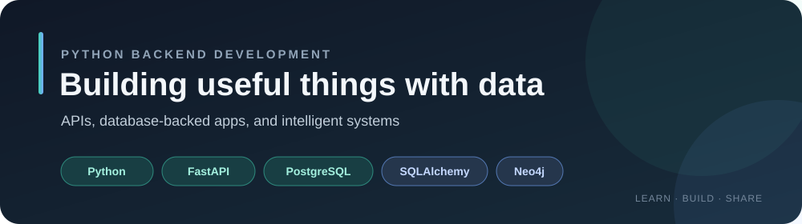

  

# Ahmad Kashif

### Python Developer | Artificial Intelligence · FastAPI · Graph Databases

I’m drawn to the art and logic of building intelligent systems — where clean code meets thoughtful architecture and ideas become something tangible. I enjoy understanding how systems work beneath the surface, designing structured solutions, and turning complex problems into something simple and purposeful.

> Think deeply. Build simply. Engineer with purpose.

## Technical Skills

| Area | Skills |
| --- | --- |
| Programming & design | Python, Object-Oriented Programming (OOP) |
| Backend & data access | FastAPI, Object-Relational Mapping (ORM), SQLAlchemy |
| Relational databases | PostgreSQL, relational database fundamentals |
| Graph databases | Neo4j, Cypher Query Language, graph data modeling |
| Other interests | Artificial Intelligence (AI), Linux fundamentals |

**Top skills:** Python · FastAPI · PostgreSQL · Cypher Query Language · Neo4j Fundamentals

## Projects

### [FastAPI Rest API](https://github.com/ahmadkashif-1/FastAPI-Rest-API)
A research-sharing API and web app using FastAPI, PostgreSQL, SQLAlchemy, JWT authentication, and a JavaScript interface.

### [FastAPI & PostgreSQL Blog API](https://github.com/ahmadkashif-1/FastAPI-PostgreSQL-CRUD)
A CRUD API for blog posts with Pydantic validation, PostgreSQL persistence, retry handling for database connections, and interactive API docs.

## Education

- **Bachelor of Science in Artificial Intelligence** — The Islamia University of Bahawalpur, 2026–Present
- **Faculty of Science, Pre-Engineering** — Punjab Group of Colleges, August 2024–June 2026

## Certifications

Three Neo4j certificates earned in September 2026:

  

- [Neo4j Fundamentals](https://graphacademy.neo4j.com/c/35ad40fc-5e5c-41d2-8b2b-5065f346fa8d/)
- [Graph Data Modeling Fundamentals](https://graphacademy.neo4j.com/c/3faf2975-4d02-472a-85ef-3792e4a29558/)
- [Cypher Fundamentals](https://graphacademy.neo4j.com/c/28a7d015-d9ac-447e-ab32-e0097b227e14/)

## Beyond the Code

I enjoy conversations about AI/ML, FastAPI, and the technologies developers should be learning next. I value clarity, precision, and craft — a quiet pursuit of *techne*, the Greek idea of skilled creation.

## Connect

- [GitHub](https://github.com/ahmadkashif-1)
- [LinkedIn](https://www.linkedin.com/in/ahmad-kashif-dev1/)
