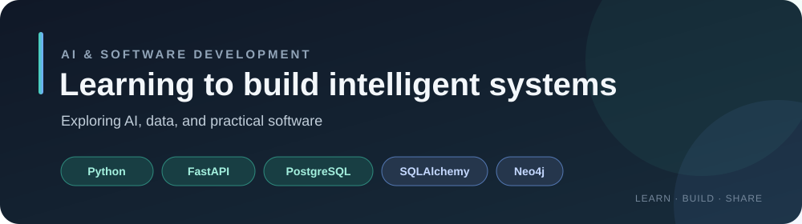
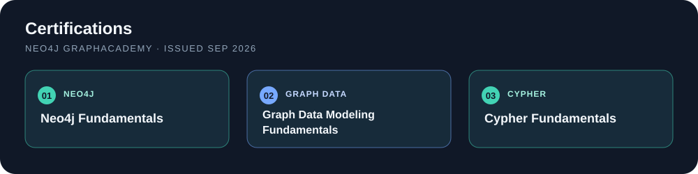

  

# Ahmad Kashif

### Aspiring AI Engineer

I’m working toward becoming an AI engineer. For now, I’m learning the foundations and building projects with Python, AI, databases, and software development.

## Skills & Interests

- **Programming:** Python, Object-Oriented Programming (OOP)
- **AI:** Artificial Intelligence
- **Backend & data:** FastAPI, SQLAlchemy (ORM), PostgreSQL, relational databases
- **Graph data:** Neo4j, Cypher Query Language, graph data modeling
- **Also learning:** Linux fundamentals

## Projects

### [FastAPI Rest API](https://github.com/ahmadkashif-1/FastAPI-Rest-API)
A research-sharing API and web app using FastAPI, PostgreSQL, SQLAlchemy, JWT authentication, and a JavaScript interface.

### [FastAPI & PostgreSQL Blog API](https://github.com/ahmadkashif-1/FastAPI-PostgreSQL-CRUD)
A blog-post CRUD API with PostgreSQL, Pydantic validation, and interactive API documentation.

## Education

- **Bachelor of Science in Artificial Intelligence** — The Islamia University of Bahawalpur, 2026–Present
- **Pre-Engineering** — Punjab Group of Colleges, 2024–2026

## Certifications

Neo4j GraphAcademy certifications in Neo4j Fundamentals, Graph Data Modeling Fundamentals, and Cypher Fundamentals.

  

- [Neo4j Fundamentals](https://graphacademy.neo4j.com/c/35ad40fc-5e5c-41d2-8b2b-5065f346fa8d/)
- [Graph Data Modeling Fundamentals](https://graphacademy.neo4j.com/c/3faf2975-4d02-472a-85ef-3792e4a29558/)
- [Cypher Fundamentals](https://graphacademy.neo4j.com/c/28a7d015-d9ac-447e-ab32-e0097b227e14/)

## Connect

- [GitHub](https://github.com/ahmadkashif-1)
- [LinkedIn](https://www.linkedin.com/in/ahmad-kashif-dev1/)
